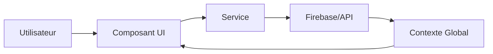

# 🏗 Architecture du Projet PluralConnect

> **Dernière mise à jour** : 19 janvier 2026
> 
> Ce document détaille l'architecture technique de l'application PluralConnect.
> Voir aussi : [VISION.md](file:///Users/faucqueurstacy/Downloads/plural-connect/VISION.md) pour la vision produit.

---

## 📱 Stack Technique

| Catégorie | Technologie |
|-----------|-------------|
| **Framework** | React Native avec [Expo](https://expo.dev/) SDK 54 |
| **Langage** | TypeScript |
| **Navigation** | `expo-router` (File-based routing) |
| **Backend** | Firebase (Auth, Firestore, Storage, Functions) |
| **Base de données** | Firestore (NoSQL) |
| **Achats In-App** | RevenueCat (`react-native-purchases`) |
| **Publicité** | Google AdMob (`react-native-google-mobile-ads`) |
| **Notifications** | Firebase Cloud Messaging + Expo Notifications |

---

## 📂 Structure Globale

```
plural-connect/
├── app/                    # 📱 Routes & Écrans (expo-router)
│   ├── (auth)/            # Authentification (login, register)
│   ├── (tabs)/            # Navigation par onglets principale
│   ├── alter-space/       # 🌟 AlterSpace (Instagram-like par alter)
│   ├── settings/          # Paramètres (13 sous-pages)
│   ├── story/             # Stories (création, visualisation)
│   └── ...                # +26 routes au total
│
├── src/                    # 💻 Code source logique
│   ├── components/        # 100+ composants UI
│   ├── services/          # 40 services métier
│   ├── contexts/          # 6 contextes globaux
│   ├── hooks/             # 7 hooks personnalisés
│   ├── lib/               # Utilitaires et configuration
│   └── types/             # Définitions TypeScript
│
├── functions/              # ☁️ Cloud Functions Firebase
├── assets/                 # 🖼 Images, icônes, fonts
└── docs/                   # 📚 Documentation
```

---

## 🚀 Routes de l'Application (`app/`)

### Routes Principales

| Route | Description | Fichier(s) clé(s) |
|-------|-------------|-------------------|
| `/` | Redirection initiale | `index.tsx` |
| `/(tabs)` | Dashboard système (accueil) | `dashboard.tsx`, `_layout.tsx` |
| `/(auth)` | Login / Register | `login.tsx`, `register.tsx` |

### 🌟 AlterSpace (Cœur de l'app)

| Route | Description |
|-------|-------------|
| `/alter-space/[alterId]` | Profil Instagram-like d'un alter |
| `/alter-space/[alterId]/edit` | Édition du profil alter |
| `/alter-space/[alterId]/gallery` | Galerie personnelle |
| `/alter-space/[alterId]/journal` | Journal intime |
| `/alter-space/[alterId]/emotions` | Suivi des émotions |

### Autres Routes

| Catégorie | Routes |
|-----------|--------|
| **Social** | `/post/create`, `/discover`, `/conversation`, `/group-chat` |
| **Stories** | `/story/create`, `/story/view` |
| **Outils** | `/journal`, `/calendar`, `/tasks`, `/inner-world`, `/courses` |
| **Crise** | `/crisis`, `/help` |
| **Shop** | `/shop`, `/premium` |
| **Admin** | `/admin` |
| **Paramètres** | `/settings/*` (13 sous-pages) |

---

## 🧩 Composants (`src/components/`)

### Composants Racine (16 fichiers)

| Composant | Description |
|-----------|-------------|
| `AlterBubble.tsx` | Bulle avatar d'un alter (Dashboard) |
| `Feed.tsx` | Fil d'actualité AlterSpace |
| `PostCard.tsx` | Carte de post (like, commentaire, partage) |
| `StoriesBar.tsx` | Barre de stories horizontale |
| `StoryViewer.tsx` | Visionneuse de stories plein écran |
| `CommentsModal.tsx` | Modal des commentaires |
| `SystemWeather.tsx` | "Météo des alters" (émotions système) |
| `FrontingStats.tsx` | Statistiques de fronting |
| `CreditBalance.tsx` | Affichage du solde de crédits |
| `SharePostModal.tsx` | Partage de posts |
| `ReportModal.tsx` | Signalement de contenu |

### Sous-dossiers (20 dossiers)

| Dossier | Contenu |
|---------|---------|
| `ui/` | 21 composants de base (Button, Input, Modal, etc.) |
| `dashboard/` | 9 composants Dashboard système |
| `alter-space/` | 10 composants AlterSpace |
| `shop/` | 9 composants boutique (LootBox, ThemePreview, etc.) |
| `messaging/` | 6 composants messagerie |
| `effects/` | 5 effets visuels (confetti, animations) |
| `stories/` | 4 composants stories |
| `ads/` | 4 composants publicité |
| `calendar/` | 2 composants calendrier |
| `widgets/` | 2 composants widgets natifs |

---

## ⚙️ Services (`src/services/`) - 40 fichiers

### 🔐 Authentification & Infrastructure

| Service | Rôle |
|---------|------|
| `GoogleAuthService.ts` | Connexion Google |
| `NotificationService.ts` | Notifications locales |
| `PushNotificationService.ts` | Notifications push Firebase |
| `AnalyticsService.ts` | Analytics Firebase |

### 👥 Social & Contenu

| Service | Rôle |
|---------|------|
| `posts.ts` | CRUD posts, likes, visibilité |
| `comments.ts` | Gestion des commentaires |
| `stories.ts` | Stories 24h |
| `follows.ts` | Système de follow système↔système |
| `friends.ts` | Système d'amis alter↔alter |
| `blocking.ts` | Blocage utilisateurs |
| `reporting.ts` | Signalement contenu |
| `share.ts` | Partage de posts |
| `social.ts` | Fonctions sociales générales |

### 🧠 Fonctionnalités TDI

| Service | Rôle |
|---------|------|
| `alters.ts` | Gestion des alters |
| `systems.ts` | Gestion des systèmes |
| `fronting.ts` | Fronting & co-fronting |
| `FrontingCheckInService.ts` | Check-in et historique fronting |
| `emotions.ts` | Suivi des émotions |
| `roles.ts` | Rôles des alters (Protecteur, etc.) |
| `groups.ts` | Groupes d'alters (catégories) |
| `InnerWorldService.ts` | InnerWorld (headspace visuel) |

### 📔 Productivité

| Service | Rôle |
|---------|------|
| `messaging.ts` | Messagerie interne |
| `tasks.ts` | Gestionnaire de tâches |
| `CalendarService.ts` | Événements calendrier |
| `help.ts` | Demandes d'aide |

### 💰 Monétisation

| Service | Rôle |
|---------|------|
| `RevenueCatService.ts` | Abonnements Premium |
| `PremiumService.ts` | Logique Premium |
| `CreditService.ts` | Système de crédits/streak |
 | `LootBoxService.ts` | Boîtes à récompenses (Coffres évolutifs) |
| `ForgeService.ts` | Forge (Crafting) avec rotation hebdomadaire |
| `FlashSaleService.ts` | Ventes flash quotidiennes |
| `DailyRewardService.ts` | Gestion des récompenses et streaks |
| `AdMediationService.ts` | Gestion publicités AdMob |
| `ConsentService.ts` | Consentement GDPR |
| `ShopData.ts` | Données boutique |
| `DecorationService.ts` | Thèmes et décorations |
| `MonetizationTypes.ts` | Types monétisation |

### 🤖 IA & Avancé

| Service | Rôle |
|---------|------|
 | `LocalAIService.ts` | IA locale (résumés, suggestions - Gemma/Native) |
| `importer.ts` | Import depuis Simply Plural, etc. |
 | `DynamicIslandService.ts` | Dynamic Island iOS (Live Activities) |
| `FeedbackService.ts` | Envoi de feedbacks |

---

## 🌐 Contextes Globaux (`src/contexts/`) - 6 fichiers

| Contexte | Rôle | Taille |
|----------|------|--------|
| `AuthContext.tsx` | Utilisateur connecté, session | 17KB |
| `MonetizationContext.tsx` | Crédits, Premium, streak | 20KB |
| `NotificationContext.tsx` | Gestion notifications | 15KB |
| `ThemeContext.tsx` | Dark/Light mode | 3.5KB |
| `NetworkContext.tsx` | État connexion réseau | 1.5KB |
| `SuccessAnimationContext.tsx` | Animations de réussite | 1KB |

---

## 🪝 Hooks Personnalisés (`src/hooks/`) - 7 fichiers

| Hook | Rôle |
|------|------|
| `useAlterData.ts` | Données alter courant |
| `useFrontNotifications.ts` | Notifications de fronting |
| `useNotifications.ts` | Gestion notifications générales |
| `useLocalAI.ts` | Fonctions IA locales |
| `useDrafts.ts` | Brouillons de posts |
| `useWatchSync.ts` | Sync Apple Watch |
| `useWidgetSync.ts` | Sync widgets natifs |

---

## 📚 Librairies & Utilitaires (`src/lib/`) - 10 fichiers

| Fichier | Rôle |
|---------|------|
| `firebase.ts` | Configuration Firebase |
| `theme.ts` | Design system (couleurs, spacing) |
| `cosmetics.ts` | Données cosmétiques (frames, thèmes) |
| `emotions.ts` | Mapping émotions ↔ emojis |
| `date.ts` | Formatage dates |
| `haptics.ts` | Retours haptiques |
| `notifications.ts` | Helpers notifications |
| `storage.ts` | AsyncStorage helpers |

---

## 🗃️ Modèle de Données (Firestore)

### Collections Racines

| Collection | Type | Description |
|------------|------|-------------|
| `systems` | `System` | Comptes utilisateurs (systèmes TDI) |
| `alters` | `Alter` | Entités au sein d'un système |
| `posts` | `Post` | Publications du feed |
| `stories` | `Story` | Stories éphémères 24h |
| `public_profiles` | `PublicProfile` | Profils publics optimisés |
| `follows` | `Follow` | Relations de suivi système↔système |

### Interfaces Principales

```typescript
// Système (compte utilisateur)
interface System {
  id: string;
  email: string;
  username: string;
  avatar_url?: string;
  bio?: string;
  headspace?: string; // 'sunny', 'cloudy', 'rainy', etc.
  alter_count?: number;
  isAdmin?: boolean;
}

// Alter (identité individuelle)
interface Alter {
  id: string;
  name: string;
  pronouns?: string;
  bio?: string;
  avatar_url?: string;
  color?: string;
  role_ids?: string[];
  is_active: boolean; // En front actuellement
  is_host?: boolean;
  password?: string; // Protection AlterSpace
  credits?: number;
  equipped_items?: { frame?: string; theme?: string; bubble?: string };
  // + triggers, safety_notes, relationships, etc.
}

// Post
interface Post {
  id: string;
  system_id: string;
  alter_id?: string;
  author_type: 'single' | 'co-front' | 'blurry';
  content: string;
  media_urls?: string[];
  visibility: 'private' | 'system' | 'friends' | 'public';
  likes: string[];
  comments_count: number;
}

// Story
interface Story {
  id: string;
  author_id: string; // Alter ID
  system_id: string;
  media_url: string;
  media_type: 'image' | 'video';
  expires_at: string; // 24h après création
  viewers: string[];
}
```

### Collections Secondaires

| Collection | Description |
|------------|-------------|
| `messages` | Chat interne/externe |
| `conversations` | Threads de conversation |
| `groups` | Groupes de discussion |
| `emotions` | Suivi émotionnel |
| `journal_entries` | Entrées de journal |
| `tasks` | Tâches avec gamification |
| `fronting_history` | Historique de fronting |
| `roles` | Rôles personnalisés |
| `inner_worlds` | InnerWorld (headspace) |
| `inner_world_shapes` | Éléments du headspace |
| `help_requests` | Demandes d'aide |
| `subjects` | Matières scolaires/études |
| `categories` | Chapitres/Catégories de cours |
| `course_notes` | Prises de notes de cours |

---

## ☁️ Cloud Functions (`functions/`)

Fonctions serverless exécutées sur Firebase :

| Fonction | Trigger | Description |
|----------|---------|-------------|
| Notifications push | Firestore `onCreate` | Envoi notif quand nouveau message |
| Nettoyage stories | Scheduled | Supprime stories > 24h |
| Statistiques | Firestore trigger | Met à jour les compteurs |
| Validation paiements | HTTPS | Vérifie les achats RevenueCat |

---

## 🔄 Flux de Données



1. **Utilisateur** interagit avec un **Composant** (`app/` ou `src/components`)
2. Le Composant appelle un **Service** (`src/services`)
3. Le Service communique avec **Firebase**
4. Les données sont stockées dans un **Contexte** (`src/contexts`)
5. L'UI se met à jour automatiquement

---

## 🔐 Fichiers de Configuration (Racine)

| Fichier | Rôle |
|---------|------|
| `app.json` | Configuration Expo (nom, permissions, plugins) |
| `firebase.json` | Config déploiement Firebase |
| `firestore.rules` | Règles de sécurité Firestore |
| `firestore.indexes.json` | Index composites Firestore |
| `storage.rules` | Règles Firebase Storage |
| `eas.json` | Configuration EAS Build |
| `package.json` | Dépendances npm |
| `tsconfig.json` | Configuration TypeScript |

---

## ✅ Bonnes Pratiques

### Conventions de Code

- **Préfixe `use`** pour les hooks
- **Services** : Toujours passer par un service pour Firestore (jamais directement dans le composant)
- **Types** : Typer props et retours de fonctions
- **Styles** : Utiliser `StyleSheet.create()` ou design system (`src/lib/theme.ts`)

### Architecture AlterSpace vs Dashboard

| Dashboard | AlterSpace |
|-----------|------------|
| Espace système commun | Espace personnel par alter |
| Fronting, journal système | Feed, journal, galerie personnel |
| Paramètres globaux | Personnalisation individuelle |
| `app/(tabs)/dashboard.tsx` | `app/alter-space/[alterId]/` |

### Fichiers à Consulter

| Contexte | Fichier |
|----------|---------|
| Vision produit | `VISION.md` |
| Architecture technique | `ARCHITECTURE.md` (ce fichier) |
| Terminologie | `project.md` |
| Tests | `docs/TESTS_FONCTIONNELS_100.md` |
| Changelog | `CHANGELOG.md` |

---

*Ce document doit être mis à jour à chaque modification structurelle majeure.*
